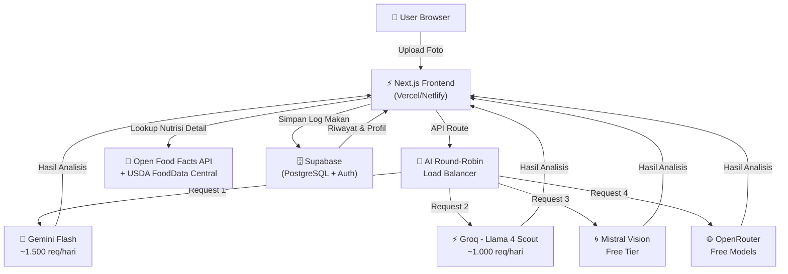
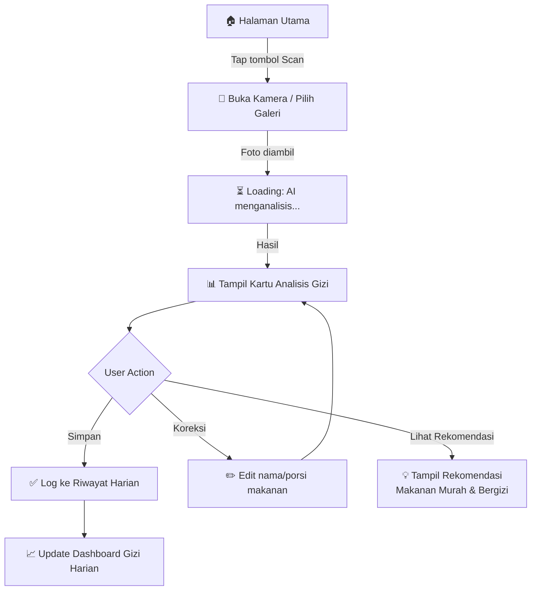
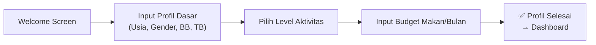
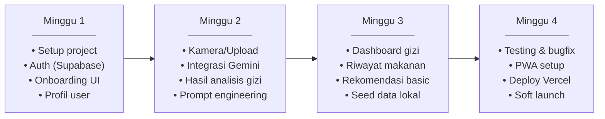

# 📋 PRD: Dompet Gizi — Asisten Gizi Cerdas untuk Anak Kost

> **Versi:** 1.0  
> **Tanggal:** 19 September 2026  
> **Status:** Draft  

---

## 1. Ringkasan Eksekutif

**Dompet Gizi** adalah web app berbasis AI yang membantu anak kost menghitung kandungan gizi makanan cukup dengan memfoto makanan mereka. Aplikasi ini memberikan analisis nutrisi instan dan rekomendasi makanan murah & bergizi yang sesuai budget anak kost.

**Semua teknologi yang digunakan 100% gratis** (free tier / open source).

---

## 2. Latar Belakang & Masalah

### Masalah yang Dihadapi Anak Kost
| Masalah | Dampak |
|---------|--------|
| Budget makan terbatas (Rp 15.000–30.000/hari) | Cenderung makan makanan murah tapi tidak bergizi |
| Tidak tahu kandungan gizi makanan | Kekurangan protein, vitamin, mineral |
| Malas menghitung kalori manual | Tidak ada awareness tentang asupan harian |
| Sulit menemukan makanan bergizi & murah | Pilihan makan monoton dan tidak seimbang |

### Peluang
- 4,5+ juta mahasiswa Indonesia tinggal di kost
- Belum ada solusi yang spesifik untuk konteks makanan Indonesia dengan budget anak kost
- AI multimodal (Gemini) kini tersedia gratis dan cukup akurat untuk food recognition

---

## 3. Target Pengguna

### Persona Utama: "Rina — Mahasiswi Kost"
- **Usia:** 18–25 tahun
- **Budget makan:** Rp 500.000–900.000/bulan
- **Pain point:** Sering makan mie instan, nasi padang, gorengan karena murah & cepat
- **Goal:** Ingin makan lebih sehat tanpa merogoh kocek lebih dalam
- **Device:** Smartphone Android (browser Chrome)

### Persona Sekunder: "Budi — Pekerja Entry-Level Ngekost"
- **Usia:** 22–30 tahun
- **Budget makan:** Rp 900.000–1.500.000/bulan
- **Pain point:** Mulai sadar kesehatan tapi bingung harus mulai dari mana
- **Goal:** Tracking gizi harian dan mendapat rekomendasi meal plan murah

---

## 4. Tujuan Produk

### Objectives & Key Results (OKR)

**Objective 1:** Membantu anak kost memahami asupan gizi mereka
- KR1: User bisa mendapat analisis gizi dari foto dalam < 5 detik
- KR2: Akurasi identifikasi makanan Indonesia ≥ 80%
- KR3: 70% user mengetahui defisiensi gizi mereka setelah 1 minggu penggunaan

**Objective 2:** Memberikan rekomendasi makanan murah & bergizi
- KR1: Setiap analisis disertai 3+ rekomendasi alternatif yang lebih murah & bergizi
- KR2: Rekomendasi relevan dengan makanan lokal warteg/kantin kampus

---

## 5. Fitur Utama (MVP)

### 5.1 📸 Scan & Analisis Makanan (Core Feature)

```
Flow: Foto Makanan → AI Recognition → Estimasi Giziiku
```

| Detail | Deskripsi |
|--------|-----------|
| **Input** | Foto dari kamera atau galeri |
| **Proses** | Gemini Flash mengidentifikasi makanan, estimasi porsi, hitung kalori & makro |
| **Output** | Kartu hasil: nama makanan, kalori, protein, lemak, karbo, serat |
| **Referensi Gizi** | AKG Indonesia (PMK No. 28/2019) sebagai baseline kebutuhan harian |

**Contoh Output:**
```
┌─────────────────────────────────────┐
│  🍛 Nasi Goreng Telur               │
│                                     │
│  Kalori    : 450 kkal (23% AKG)     │
│  Protein   : 12g    (20% AKG)      │
│  Lemak     : 18g    (28% AKG)      │
│  Karbo     : 58g    (18% AKG)      │
│  Serat     : 2g     (7% AKG)       │
│                                     │
│  ⚠️ Rendah protein & serat          │
│  💡 Tambah tempe goreng (+Rp 3.000)  │
│     → Protein naik ke 30g (50% AKG) │
└─────────────────────────────────────┘
```

### 5.2 🎯 Dashboard Gizi Harian

- Progress bar visual untuk setiap makronutrien (kalori, protein, lemak, karbo, serat)
- Perbandingan dengan AKG harian berdasarkan usia & jenis kelamin
- Warna hijau/kuning/merah untuk indikator kecukupan
- History makanan 7 hari terakhir

### 5.3 💰 Rekomendasi Makanan Murah & Bergizi

Berdasarkan defisiensi gizi dari makanan yang sudah di-scan:

| Fitur | Detail |
|-------|--------|
| **Rekomendasi Instan** | Setiap scan langsung tampilkan alternatif yang lebih bergizi |
| **Budget Filter** | Filter rekomendasi berdasarkan budget (< Rp 10K, < Rp 15K, < Rp 20K) |
| **Sumber Rekomendasi** | Database makanan warteg/kantin + harga rata-rata lokal |
| **Meal Plan Mingguan** | Saran menu 7 hari sesuai budget yang diinput user |

**Contoh Rekomendasi:**
```
🧮 Kamu kurang Protein hari ini (baru 35% AKG)

Rekomendasi makanan murah tinggi protein:
┌──────────────────┬────────┬──────────┬───────┐
│ Makanan          │ Harga  │ Protein  │ Kalori│
├──────────────────┼────────┼──────────┼───────┤
│ Tempe Goreng (2) │ Rp 4K  │ 18g      │ 200   │
│ Telur Rebus (2)  │ Rp 5K  │ 14g      │ 150   │
│ Tahu Bacem (3)   │ Rp 5K  │ 15g      │ 180   │
│ Pecel Lele       │ Rp 12K │ 22g      │ 350   │
│ Nasi Ayam Geprek │ Rp 15K │ 25g      │ 450   │
└──────────────────┴────────┴──────────┴───────┘
```

### 5.4 👤 Profil & Onboarding

- Input: usia, jenis kelamin, berat badan, tinggi badan, aktivitas fisik
- Kalkulasi kebutuhan kalori harian (BMR × Activity Factor)
- Referensi AKG Indonesia (PMK No. 28/2019)
- Bisa dilewati (skip) dengan default profil mahasiswa umum

---

## 6. Tech Stack (100% Gratis)

### Arsitektur Sistem (Round-Robin Multi-AI)



### Detail Tech Stack

| Layer | Teknologi | Biaya | Catatan |
|-------|-----------|-------|---------|
| **Frontend** | Next.js 15 + React 19 | Gratis | App Router, Server Components |
| **Styling** | Tailwind CSS + shadcn/ui | Gratis | Mobile-first responsive |
| **AI Engine 1** | Google Gemini Flash (Free Tier) | Gratis | ~1.500 req/hari, multimodal |
| **AI Engine 2** | Groq — Llama 4 Scout (Free Tier) | Gratis | ~1.000 req/hari, 30 RPM, super cepat |
| **AI Engine 3** | Mistral Vision (Free Tier) | Gratis | Free experimentation, no card |
| **AI Engine 4** | OpenRouter (Free Models) | Gratis | Multi-model gateway, filter `:free` |
| **AI Strategy** | Round-Robin Load Balancer | — | Distribusi merata ke 4 provider |
| **Nutrition DB 1** | Open Food Facts API | Gratis | Produk kemasan, open source |
| **Nutrition DB 2** | USDA FoodData Central API | Gratis | Data gizi akurat, perlu API key gratis |
| **Database** | Supabase (Free Tier) | Gratis | 500MB PostgreSQL, 50K MAU, Auth |
| **File Storage** | Supabase Storage | Gratis | 1GB, untuk foto makanan |
| **Hosting** | Vercel Hobby / Netlify Free | Gratis | 100GB bandwidth |
| **Analytics** | Umami (Self-hosted) atau Vercel Analytics | Gratis | Privacy-friendly |
| **PWA** | next-pwa | Gratis | Install di homescreen HP |

### Kenapa Round-Robin Multi-AI?

> [!TIP]
> Dengan strategi **Round-Robin**, request didistribusikan merata ke 4 AI provider gratis. Ini memberikan:
> - **~4.000+ request/hari GRATIS** (gabungan semua provider)
> - **High Availability** — jika satu provider down/limit, otomatis skip ke provider berikutnya
> - **Tidak tergantung 1 vendor** — mengurangi risiko vendor lock-in
> - **Konsisten** — semua provider menggunakan prompt & format output JSON yang sama

### Detail AI Providers

| # | Provider | Model | Free Limit | Multimodal | Kecepatan | Signup |
|---|----------|-------|-----------|:---:|:---:|--------|
| 1 | **Gemini** | Gemini 2.5 Flash | ~1.500 req/hari | ✅ | ⚡ Cepat | [aistudio.google.com](https://aistudio.google.com) |
| 2 | **Groq** | Llama 4 Scout | ~1.000 req/hari | ✅ | ⚡⚡ Sangat Cepat | [console.groq.com](https://console.groq.com) |
| 3 | **Mistral** | Mistral Vision | Free tier | ✅ | ⚡ Cepat | [console.mistral.ai](https://console.mistral.ai) |
| 4 | **OpenRouter** | Various `:free` | Varies | ✅ | ⚡ Varies | [openrouter.ai](https://openrouter.ai) |
| | **TOTAL** | | **~4.000+ req/hari** | | | |

### Mekanisme Round-Robin

```
┌─────────────────────────────────────────────────────────┐
│                 AI ROUND-ROBIN FLOW                      │
│                                                         │
│  Request masuk → Cek counter di Redis/Memory            │
│                                                         │
│  Counter % 4 == 0  →  🤖 Gemini Flash                  │
│  Counter % 4 == 1  →  ⚡ Groq (Llama 4 Scout)          │
│  Counter % 4 == 2  →  🌀 Mistral Vision                │
│  Counter % 4 == 3  →  🌐 OpenRouter (Free Model)       │
│                                                         │
│  Jika provider GAGAL/LIMIT:                             │
│  → Skip ke provider berikutnya (auto-failover)          │
│  → Log error untuk monitoring                           │
│  → Tandai provider sebagai "cooldown" 1 jam             │
│                                                         │
│  Response Format: SAMA untuk semua provider (JSON)      │
│  → Unified prompt template yang di-adapt per provider   │
└─────────────────────────────────────────────────────────┘
```

### Pseudocode Round-Robin Service

```typescript
// lib/ai-round-robin.ts

const AI_PROVIDERS = [
  { name: 'gemini',     adapter: geminiAdapter,     dailyLimit: 1500, used: 0 },
  { name: 'groq',       adapter: groqAdapter,       dailyLimit: 1000, used: 0 },
  { name: 'mistral',    adapter: mistralAdapter,     dailyLimit: 500,  used: 0 },
  { name: 'openrouter', adapter: openrouterAdapter,  dailyLimit: 500,  used: 0 },
];

let currentIndex = 0;

async function analyzeFood(imageBase64: string): Promise<FoodAnalysisResult> {
  const maxRetries = AI_PROVIDERS.length;

  for (let attempt = 0; attempt < maxRetries; attempt++) {
    const provider = AI_PROVIDERS[currentIndex % AI_PROVIDERS.length];
    currentIndex++;

    // Skip jika provider sudah limit
    if (provider.used >= provider.dailyLimit) continue;

    try {
      const result = await provider.adapter.analyze(imageBase64, UNIFIED_PROMPT);
      provider.used++;
      return normalizeResponse(result); // Normalize ke format JSON yang sama
    } catch (error) {
      console.warn(`[${provider.name}] failed, trying next...`, error);
      continue; // Auto-failover ke provider berikutnya
    }
  }

  throw new Error('Semua AI provider sedang tidak tersedia');
}

// Reset counter setiap tengah malam
function resetDailyCounters() {
  AI_PROVIDERS.forEach(p => p.used = 0);
}
```

---

## 7. Arsitektur Data

### 7.1 Database Schema (Supabase/PostgreSQL)

```sql
-- Tabel Users
CREATE TABLE users (
  id UUID PRIMARY KEY DEFAULT gen_random_uuid(),
  email TEXT UNIQUE NOT NULL,
  name TEXT,
  age INTEGER,
  gender TEXT CHECK (gender IN ('male', 'female')),
  weight_kg DECIMAL,
  height_cm DECIMAL,
  activity_level TEXT CHECK (activity_level IN ('sedentary', 'light', 'moderate', 'active')),
  daily_calorie_target INTEGER,
  daily_protein_target INTEGER,
  daily_fat_target INTEGER,
  daily_carb_target INTEGER,
  monthly_food_budget INTEGER, -- dalam Rupiah
  created_at TIMESTAMPTZ DEFAULT NOW()
);

-- Tabel Food Logs (Riwayat Makan)
CREATE TABLE food_logs (
  id UUID PRIMARY KEY DEFAULT gen_random_uuid(),
  user_id UUID REFERENCES users(id) ON DELETE CASCADE,
  food_name TEXT NOT NULL,
  food_name_en TEXT, -- untuk lookup di USDA/OpenFoodFacts
  photo_url TEXT,
  calories DECIMAL,
  protein_g DECIMAL,
  fat_g DECIMAL,
  carbs_g DECIMAL,
  fiber_g DECIMAL,
  meal_type TEXT CHECK (meal_type IN ('breakfast', 'lunch', 'dinner', 'snack')),
  ai_confidence DECIMAL, -- confidence score dari Gemini
  logged_at TIMESTAMPTZ DEFAULT NOW()
);

-- Tabel Rekomendasi Makanan Lokal (Seed Data)
CREATE TABLE local_foods (
  id UUID PRIMARY KEY DEFAULT gen_random_uuid(),
  name TEXT NOT NULL,
  category TEXT, -- 'lauk', 'sayur', 'pokok', 'snack'
  avg_price_idr INTEGER,
  calories DECIMAL,
  protein_g DECIMAL,
  fat_g DECIMAL,
  carbs_g DECIMAL,
  fiber_g DECIMAL,
  availability TEXT, -- 'warteg', 'kantin', 'minimarket', 'masak_sendiri'
  is_budget_friendly BOOLEAN DEFAULT true
);
```

### 7.2 Prompt Engineering untuk Gemini

```
System Prompt (Food Analysis):
---------------------------------
Kamu adalah ahli gizi yang menganalisis foto makanan Indonesia.

Dari foto yang diberikan:
1. Identifikasi semua item makanan yang terlihat
2. Estimasi porsi dalam gram
3. Hitung kandungan gizi per item dan total
4. Berikan confidence score (0-1) untuk setiap identifikasi

Respond dalam format JSON:
{
  "foods": [
    {
      "name": "Nasi Putih",
      "name_en": "White Rice",
      "portion_grams": 200,
      "confidence": 0.95,
      "nutrition": {
        "calories": 260,
        "protein_g": 4.4,
        "fat_g": 0.4,
        "carbs_g": 57,
        "fiber_g": 0.6
      }
    }
  ],
  "total_nutrition": { ... },
  "health_notes": ["Rendah protein", "Tambahkan lauk kaya protein"]
}
```

---

## 8. User Flow

### 8.1 Flow Utama: Scan Makanan



### 8.2 Flow Onboarding



---

## 9. Wireframe Deskripsi (Halaman Utama)

### Mobile-First Layout

```
┌─────────────────────────────────┐
│  🥗 Dompet Gizi         👤 Profil  │
├─────────────────────────────────┤
│                                 │
│  Hai, Rina! 👋                  │
│  Budget hari ini: Rp 25.000     │
│                                 │
│  ┌─── Kalori Hari Ini ────────┐ │
│  │ ████████░░░░  1.250/2.000  │ │
│  │ Protein  ███░░░  35/60g    │ │
│  │ Lemak    █████░  45/65g    │ │
│  │ Karbo    ██████░ 180/300g  │ │
│  │ Serat    ██░░░░  8/25g     │ │
│  └────────────────────────────┘ │
│                                 │
│  ⚠️ Kamu kurang Protein & Serat │
│  💡 Makan tempe/tahu hari ini!  │
│                                 │
│  📋 Makanan Hari Ini:           │
│  ┌────────────────────────────┐ │
│  │ 🍳 Sarapan: Nasi Telur     │ │
│  │    350 kkal | Rp 8.000     │ │
│  ├────────────────────────────┤ │
│  │ 🍛 Siang: Nasi Ayam Geprek │ │
│  │    550 kkal | Rp 15.000    │ │
│  ├────────────────────────────┤ │
│  │ + Tambah Makanan           │ │
│  └────────────────────────────┘ │
│                                 │
├────────┬────────┬───────────────┤
│ 🏠Home │📸 Scan │ 📊 Riwayat    │
└────────┴────────┴───────────────┘
```

---

## 10. Halaman-Halaman Aplikasi

| # | Halaman | Deskripsi |
|---|---------|-----------|
| 1 | **Landing Page** | Hero section, penjelasan fitur, CTA "Mulai Gratis" |
| 2 | **Auth (Login/Register)** | Login via Google (Supabase Auth) atau email |
| 3 | **Onboarding** | Wizard 3 step (profil, aktivitas, budget) |
| 4 | **Dashboard (Home)** | Progress gizi hari ini, ringkasan makanan, notifikasi defisiensi |
| 5 | **Scan/Upload** | Kamera + upload, preview foto, tombol analisis |
| 6 | **Hasil Analisis** | Kartu gizi per makanan, total, health notes, rekomendasi |
| 7 | **Rekomendasi** | Daftar makanan murah & bergizi, filter budget, meal plan |
| 8 | **Riwayat** | Calendar view + daftar makanan per hari, grafik tren mingguan |
| 9 | **Profil & Setting** | Edit data diri, target gizi, budget, tema gelap |

---

## 11. Fitur Post-MVP (V2+)

| Prioritas | Fitur | Deskripsi |
|-----------|-------|-----------|
| 🔴 High | **Barcode Scanner** | Scan kemasan makanan → lookup Open Food Facts |
| 🔴 High | **Meal Plan Generator** | AI generate menu 7 hari sesuai budget & target gizi |
| 🟡 Medium | **Komunitas** | Share meal plan & tips antar sesama anak kost |
| 🟡 Medium | **Notifikasi Makan** | Reminder untuk log makanan 3x sehari |
| 🟡 Medium | **Gamifikasi** | Streak, badge, level untuk menjaga konsistensi |
| 🟢 Low | **Integrasi GoFood/GrabFood** | Rekomendasi menu murah & bergizi dari food delivery |
| 🟢 Low | **Multi-bahasa** | Support Bahasa Indonesia + English |

---

## 12. Seed Data: Database Makanan Lokal

Untuk MVP, kita perlu menyiapkan **seed data** makanan yang umum di warteg/kantin kampus:

```json
[
  {
    "name": "Nasi Putih",
    "category": "pokok",
    "avg_price_idr": 3000,
    "calories": 260, "protein_g": 4.4, "fat_g": 0.4, "carbs_g": 57, "fiber_g": 0.6,
    "availability": "warteg"
  },
  {
    "name": "Tempe Goreng (2 potong)",
    "category": "lauk",
    "avg_price_idr": 4000,
    "calories": 200, "protein_g": 18, "fat_g": 10, "carbs_g": 8, "fiber_g": 3,
    "availability": "warteg"
  },
  {
    "name": "Tahu Bacem (3 buah)",
    "category": "lauk",
    "avg_price_idr": 5000,
    "calories": 180, "protein_g": 15, "fat_g": 9, "carbs_g": 6, "fiber_g": 1,
    "availability": "warteg"
  },
  {
    "name": "Telur Dadar",
    "category": "lauk",
    "avg_price_idr": 5000,
    "calories": 150, "protein_g": 10, "fat_g": 11, "carbs_g": 1, "fiber_g": 0,
    "availability": "warteg"
  },
  {
    "name": "Sayur Bayam",
    "category": "sayur",
    "avg_price_idr": 3000,
    "calories": 40, "protein_g": 3, "fat_g": 0.5, "carbs_g": 6, "fiber_g": 4,
    "availability": "warteg"
  },
  {
    "name": "Ayam Goreng",
    "category": "lauk",
    "avg_price_idr": 10000,
    "calories": 300, "protein_g": 25, "fat_g": 18, "carbs_g": 5, "fiber_g": 0,
    "availability": "warteg"
  },
  {
    "name": "Pecel Lele + Nasi",
    "category": "paket",
    "avg_price_idr": 12000,
    "calories": 550, "protein_g": 28, "fat_g": 22, "carbs_g": 60, "fiber_g": 2,
    "availability": "kantin"
  },
  {
    "name": "Mie Instan (1 bungkus)",
    "category": "pokok",
    "avg_price_idr": 3500,
    "calories": 380, "protein_g": 8, "fat_g": 14, "carbs_g": 52, "fiber_g": 2,
    "availability": "masak_sendiri"
  }
]
```

> [!IMPORTANT]
> Data harga dan gizi di atas adalah estimasi awal. Untuk akurasi lebih baik, kombinasikan dengan data dari **USDA FoodData Central** (data gizi) dan **survei harga lokal** (data harga).

---

## 13. API Integration Detail

### 13.1 AI Providers (Round-Robin)

#### 🤖 Provider 1: Google Gemini Flash

```
Endpoint: https://generativelanguage.googleapis.com/v1beta/models/gemini-2.5-flash:generateContent
Method: POST
Auth: API Key (gratis dari aistudio.google.com)
Free Tier: ~1.500 request/hari
SDK: @google/generative-ai
```

#### ⚡ Provider 2: Groq (Llama 4 Scout)

```
Endpoint: https://api.groq.com/openai/v1/chat/completions
Method: POST
Auth: API Key (gratis dari console.groq.com, no credit card)
Free Tier: ~1.000 req/hari, 30 RPM
SDK: groq-sdk (OpenAI-compatible)
Model: meta-llama/llama-4-scout-17b-16e-instruct
```

#### 🌀 Provider 3: Mistral Vision

```
Endpoint: https://api.mistral.ai/v1/chat/completions
Method: POST
Auth: API Key (gratis dari console.mistral.ai, no credit card)
Free Tier: Free experimentation tier
SDK: @mistralai/mistralai
Model: mistral-small-latest (vision-capable)
```

#### 🌐 Provider 4: OpenRouter (Free Models)

```
Endpoint: https://openrouter.ai/api/v1/chat/completions
Method: POST
Auth: API Key (gratis dari openrouter.ai)
Free Tier: Filter model dengan tag `:free`
SDK: OpenAI-compatible
Model: Varies (contoh: qwen/qwen-2.5-vl-72b-instruct:free)
```

> [!IMPORTANT]
> Semua provider menggunakan **Unified Prompt** yang sama dan output di-normalize ke **format JSON yang identik**, sehingga frontend tidak perlu tahu provider mana yang sedang digunakan.

### 13.2 Open Food Facts API (Nutrisi Produk Kemasan)

```
Endpoint: https://world.openfoodfacts.org/api/v2/product/{barcode}
Method: GET
Auth: Tidak perlu (open API)
Rate Limit: Reasonable use

Penggunaan:
- Lookup nutrisi produk kemasan (mie instan, susu, roti, dll)
- Sebagai cross-check data dari Gemini
```

### 13.3 USDA FoodData Central (Data Gizi Ilmiah)

```
Endpoint: https://api.nal.usda.gov/fdc/v1/foods/search
Method: GET
Auth: API Key gratis dari data.gov
Rate Limit: 1.000 request/jam

Penggunaan:
- Lookup data gizi generic food (nasi, telur, daging, dll)
- Data lebih akurat & ilmiah sebagai fallback
```

### 13.4 Supabase (Auth + Database + Storage)

```
URL: https://<project>.supabase.co
Auth: Anon Key + Service Key
Free Tier: 500MB DB, 1GB Storage, 50K MAU

Penggunaan:
- User authentication (Google OAuth, email)
- Simpan profil user, food logs, preferences
- Storage foto makanan
```

---

## 14. Non-Functional Requirements

| Aspek | Requirement |
|-------|-------------|
| **Performance** | Analisis foto < 5 detik (termasuk upload + AI) |
| **Responsiveness** | Mobile-first, support layar 360px–1440px |
| **Offline** | PWA: bisa buka dashboard offline, sync saat online |
| **Aksesibilitas** | Contrast ratio ≥ 4.5:1, font min 14px |
| **Keamanan** | HTTPS, Row Level Security di Supabase, sanitized input |
| **Privacy** | Data foto hanya disimpan di Supabase user sendiri |
| **SEO** | Landing page SSR untuk discoverability |

---

## 15. Milestones & Timeline

### Phase 1: MVP (4 minggu)



### Phase 2: Enhancement (4 minggu)
- Barcode scanner
- Meal plan generator AI
- Grafik tren mingguan
- Gamifikasi dasar

### Phase 3: Growth (4 minggu)
- Komunitas & sharing
- Notifikasi reminder
- Optimasi performa
- Marketing & user acquisition

---

## 16. Risiko & Mitigasi

| Risiko | Probabilitas | Dampak | Mitigasi |
|--------|:---:|:---:|---------|
| Gemini free tier limit habis | 🟡 Medium | 🔴 High | Rate limiting per user (max 10 scan/hari), caching hasil, fallback ke input manual |
| Akurasi AI rendah untuk makanan Indonesia | 🟡 Medium | 🟡 Medium | Prompt engineering spesifik, allow user koreksi, feedback loop |
| Supabase 500MB habis | 🟢 Low | 🟡 Medium | Kompres foto, cleanup old logs, upgrade jika perlu |
| User engagement rendah | 🟡 Medium | 🔴 High | Gamifikasi, push notification, konten edukasi gizi |
| Data harga makanan tidak akurat | 🟡 Medium | 🟢 Low | Crowdsource dari user, update berkala, region-based pricing |

---

## 17. Metrik Keberhasilan

| Metrik | Target (3 bulan pertama) |
|--------|--------------------------|
| **Total Registered Users** | 500+ |
| **Daily Active Users (DAU)** | 50+ |
| **Scan per User per Day** | 2–3x |
| **Retention (D7)** | ≥ 30% |
| **Avg Session Duration** | ≥ 3 menit |
| **NPS Score** | ≥ 40 |

---

## 18. Estimasi Biaya

| Item | Biaya |
|------|-------|
| Hosting (Vercel/Netlify) | **Rp 0** |
| Database (Supabase) | **Rp 0** |
| AI API (Gemini Flash) | **Rp 0** |
| Nutrition API (Open Food Facts + USDA) | **Rp 0** |
| Domain (.com) | **~Rp 150.000/tahun** (opsional) |
| **Total** | **Rp 0 – Rp 150.000/tahun** |

> [!NOTE]
> Estimasi ini untuk skala MVP dengan < 1.000 DAU. Jika scaling dibutuhkan, Gemini dan Supabase paid tier mulai dari ~$25/bulan.

---

## 19. Competitive Landscape

| Kompetitor | Kelebihan Mereka | Kelemahan Mereka | Diferensiasi Dompet Gizi |
|-----------|------------------|------------------|-----------------------|
| MyFitnessPal | Database besar, tracking lengkap | Input manual, tidak ada foto scan gratis, fokus western food | Auto-scan foto, konteks Indonesia |
| FatSecret | Gratis, database lumayan | UI kuno, tidak ada rekomendasi budget | Rekomendasi budget anak kost |
| Calorie Mama | Foto scan AI | Berbayar, tidak ada konteks lokal | Gratis, fokus makanan warteg/kantin |
| NutriAI (generik) | AI modern | Tidak ada konteks budget mahasiswa Indonesia | Budget-aware, harga makanan lokal |

---

## Lampiran: Referensi AKG Indonesia (PMK No. 28/2019)

Contoh AKG untuk kelompok usia mahasiswa/pekerja muda:

| Zat Gizi | Laki-laki (19-29 thn) | Perempuan (19-29 thn) |
|----------|:---:|:---:|
| Energi (kkal) | 2.650 | 2.250 |
| Protein (g) | 65 | 60 |
| Lemak (g) | 75 | 65 |
| Karbohidrat (g) | 430 | 360 |
| Serat (g) | 37 | 32 |
| Vitamin C (mg) | 90 | 75 |
| Zat Besi (mg) | 9 | 18 |
| Kalsium (mg) | 1.200 | 1.200 |

> Sumber: Peraturan Menteri Kesehatan No. 28 Tahun 2019

---

*Dokumen ini siap untuk dijadikan dasar pengembangan. Klik **Proceed** untuk mulai membangun Dompet Gizi! 🚀*
